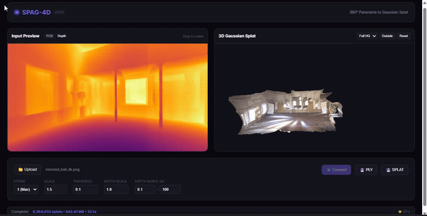

# SPAG-4D: Turn 360° Photos and Videos Into 3D Worlds



SPAG-4D takes your 360° panoramic photos and videos and turns them into explorable 3D scenes using Gaussian Splatting. Walk through your panoramas, fly around them, and view them from any angle.

## What It Does

You give it a 360° photo or video. It gives you back a 3D scene you can explore.

Under the hood, SPAG-4D uses two AI models working together:

1. **DAP** (Depth Any Panoramas) figures out how far away everything in your photo is
2. **SHARP** (Apple's ML-SHARP) adds fine detail, realistic lighting, and refined surfaces

The result is a dense cloud of 3D Gaussians (tiny colored blobs) that reconstruct your scene in full 3D.

## Features

### Core
- **360° to 3D** -- Convert equirectangular panoramas into 3D Gaussian Splat scenes
- **Real-world depth** -- DAP estimates metric depth in meters, so your scene has realistic scale
- **Standard output** -- PLY files work with gsplat, SuperSplat, and any 3DGS viewer
- **Compressed output** -- SPLAT format is ~8x smaller for sharing on the web

### SHARP Quality Engine (Enabled by Default)
- **Maximum detail preservation** -- Low-pass filter tuned to 0.001 (10x more detail than stock SHARP)
- **Overlapping depth patches** -- Reduces visible seams at cubemap face boundaries
- **Full color refinement** -- SHARP refines colors, opacities, and scales simultaneously
- **Correct disparity computation** -- Normalized focal length for accurate 3D geometry
- **DINOv2 patch alignment** -- Cubemap size auto-validated against 384px patch grid
- **Cubemap or icosahedral projection** -- 6-face (fast) or 20-face (higher quality) modes

### Video
- **360° video support** -- Automatically extracts frames and converts each to 3D
- **Temporal smoothing** -- EMA smoothing across frames for depth, opacity, scale, and color to reduce flickering
- **Visual odometry stabilization** -- Optional camera shake removal
- **Frame-precise trimming** -- Set start time and duration to process just the part you need

### Interface
- **Web UI** -- Upload, adjust settings, and preview results in a built-in 3D viewer
- **CLI** -- Batch processing, scripting, and automation
- **Python API** -- Integrate SPAG-4D into your own projects

---

## Installation

### What You Need

- A computer running **Windows**, **macOS**, or **Linux**
- **Python 3.10 or newer** -- [Download here](https://www.python.org/downloads/)
  - During install on Windows, check the box that says **"Add Python to PATH"**
- **Git** -- [Download here](https://git-scm.com/downloads)
- An **NVIDIA GPU** with 8GB+ VRAM is strongly recommended (it will work on CPU, just much slower)
- About **6 GB of free disk space** (models download automatically on first run)

### Step 1: Download SPAG-4D

Open a terminal (PowerShell on Windows, Terminal on Mac/Linux) and run:

```
git clone --recurse-submodules https://github.com/cedarconnor/SPAG4d.git
cd SPAG4d
```

If you already downloaded it before, run this to make sure everything is up to date:

```
git submodule update --init --recursive
```

### Step 2: Create a Virtual Environment

This keeps SPAG-4D's files separate from the rest of your system.

**Windows (PowerShell):**
```
python -m venv .venv
.\.venv\Scripts\activate
```

**Mac / Linux:**
```
python -m venv .venv
source .venv/bin/activate
```

You should see `(.venv)` appear at the start of your terminal line. That means it worked.

> **Windows troubleshooting:** If PowerShell says "running scripts is disabled", run this command first, then try activating again:
> ```
> Set-ExecutionPolicy -Scope CurrentUser -ExecutionPolicy RemoteSigned
> ```

### Step 3: Install PyTorch

**If you have an NVIDIA GPU** (recommended):
```
pip install torch torchvision --index-url https://download.pytorch.org/whl/cu121
```

**If you don't have an NVIDIA GPU** (CPU only -- slower but works):
```
pip install torch torchvision --index-url https://download.pytorch.org/whl/cpu
```

### Step 4: Install SPAG-4D

```
pip install -e ".[server,download]"
```

This installs the core tool plus the web interface.

### Step 5: Install SHARP (Highly Recommended)

SHARP is what gives SPAG-4D its best quality output. It is enabled by default, but needs to be installed separately because it comes from Apple's GitHub:

```
pip install git+https://github.com/apple/ml-sharp.git
```

The SHARP model weights (~3 GB) download automatically the first time you run a conversion.

To verify it installed correctly:
```
python -c "import sharp; print('SHARP installed successfully')"
```

> **Without SHARP:** SPAG-4D still works, but you'll get geometric-only Gaussians without the learned detail refinement. You'll see a warning message.

### Step 6: Install ffmpeg (For Video)

If you want to convert 360° videos, you also need ffmpeg:

- **Windows:** Download from [ffmpeg.org](https://ffmpeg.org/download.html) and add it to your PATH
- **Mac:** `brew install ffmpeg`
- **Linux:** `sudo apt install ffmpeg`

### Troubleshooting

| Problem | Solution |
|---------|----------|
| `No module named 'spag4d.dap_arch.DAP.networks'` | Run `git submodule update --init --recursive` |
| `python` or `pip` not found | Reinstall Python and make sure "Add to PATH" is checked |
| PowerShell blocks `.venv` activation | Run the `Set-ExecutionPolicy` command shown above |
| Out of GPU memory | Use a higher `stride` value (4 or 8) or use `--sharp-cubemap-size 768` |
| SHARP not found warning | Run `pip install git+https://github.com/apple/ml-sharp.git` |

---

## Usage

### Web UI (Easiest)

1. Start the server:
   ```
   .\start_spag4d.bat
   ```
   Or manually:
   ```
   python -m spag4d.cli serve --port 7860
   ```

2. Open **http://localhost:7860** in your browser

3. Upload a 360° panoramic image or video

4. Adjust settings if you want (the defaults are tuned for maximum quality)

5. Click **Convert** and explore your 3D scene in the viewer

**Viewer controls:** WASD to move, mouse to look, scroll to zoom.

### Command Line

```bash
# Convert a single panorama (SHARP enabled by default)
python -m spag4d.cli convert panorama.jpg output.ply

# Convert without SHARP (faster, lower quality)
python -m spag4d.cli convert panorama.jpg output.ply --no-sharp-refine

# Higher quality with icosahedral projection (20 faces instead of 6)
python -m spag4d.cli convert panorama.jpg output.ply --sharp-projection icosahedral

# Output as compressed SPLAT for web
python -m spag4d.cli convert panorama.jpg output.splat --format splat

# Convert all panoramas in a folder
python -m spag4d.cli convert ./photos/ ./output/ --batch

# Convert a 360° video (5 seconds starting at 10s, 10 fps)
python -m spag4d.cli convert-video video.mp4 ./frames/ \
    --fps 10 --start 10.0 --duration 5.0

# Video with stabilization
python -m spag4d.cli convert-video video.mp4 ./frames/ \
    --fps 10 --stabilize
```

### Python API

```python
from spag4d import SPAG4D

# SHARP is enabled by default -- just create the converter
converter = SPAG4D(device="cuda")

result = converter.convert(
    input_path="panorama.jpg",
    output_path="output.ply",
    stride=2,
    scale_factor=1.5,
)

print(f"Generated {result.splat_count:,} Gaussians in {result.processing_time:.1f}s")

# To disable SHARP for a specific conversion:
result = converter.convert(
    input_path="panorama.jpg",
    output_path="output_fast.ply",
    use_sharp_refinement=False,
)
```

---

## Settings Reference

### General

| Setting | Default | What It Does |
|---------|---------|--------------|
| `stride` | 2 | How much to downsample. 1 = full resolution (slow), 8 = fast preview |
| `scale_factor` | 1.5 | How big each Gaussian blob is. Higher = more overlap between splats |
| `thickness` | 0.1 | How thick each splat is in the depth direction |
| `global_scale` | 1.0 | Multiply all depths by this value to fix scale issues |
| `depth_min` | 0.1 | Ignore anything closer than this (meters) |
| `depth_max` | 100.0 | Ignore anything farther than this (meters) |
| `sky_threshold` | 80.0 | Remove points beyond this distance (cuts out sky artifacts) |
| `format` | ply | Output format: `ply`, `splat`, or `both` |

### SHARP Quality

SHARP refinement is **enabled by default**. Use `--no-sharp-refine` to turn it off.

| Setting | Default | What It Does |
|---------|---------|--------------|
| `sharp_refine` | **True** | Enable SHARP detail refinement |
| `sharp_cubemap_size` | 1536 | Resolution of each projection face. Must be a multiple of 384. Higher = better quality, more VRAM |
| `sharp_projection` | cubemap | `cubemap` (6 faces, fast) or `icosahedral` (20 faces, better quality) |
| `scale_blend` | 0.5 | How much SHARP influences Gaussian sizes. 0 = geometric only, 1 = fully learned |
| `opacity_blend` | 1.0 | How much SHARP influences transparency. 0 = uniform, 1 = fully learned |

### Video

| Setting | Default | What It Does |
|---------|---------|--------------|
| `fps` | 10 | Frames per second to extract from video |
| `start` | 0.0 | Start time in seconds |
| `duration` | full video | How many seconds to process |
| `temporal_alpha` | 0.3 | Smoothing between frames (0 = off, higher = smoother). Applies to depth, opacity, scale, and color |
| `stabilize` | off | Enable visual odometry to reduce camera shake |

### SHARP Projection Modes

SHARP works by projecting your 360° image onto flat faces, running AI on each face, then stitching the results back together.

| Mode | Faces | Quality | Speed | VRAM |
|------|-------|---------|-------|------|
| `cubemap` | 6 | Good | Fast | ~6 GB |
| `icosahedral` | 20 | Better (less seam artifacts) | ~3x slower | ~12 GB |

### Valid Cubemap Sizes

The cubemap size must align with SHARP's DINOv2 patch grid (multiples of 384). If you pass an invalid size, SPAG-4D will automatically adjust to the nearest valid value.

| Size | Quality | VRAM Needed |
|------|---------|-------------|
| 768 | Low | ~3 GB |
| 1536 | **Default** | ~6 GB |
| 1920 | High | ~8 GB |
| 2304 | Very High | ~12 GB |
| 3072 | Ultra | ~16 GB+ |

---

## System Requirements

| Component | Minimum | Recommended |
|-----------|---------|-------------|
| Python | 3.10 | 3.11+ |
| GPU | Any NVIDIA (4GB+) | RTX 3060+ (8GB+ VRAM) |
| RAM | 8 GB | 16 GB+ |
| Disk | 6 GB free | 10 GB+ free |
| OS | Windows 10, macOS 12, Ubuntu 20.04 | Latest |

CPU-only mode works but is significantly slower.

---

## Project Structure

```
SPAG4d/
├── spag4d/                # Main package
│   ├── core.py            # Pipeline orchestrator
│   ├── sharp_refiner.py   # SHARP integration + max quality config
│   ├── gaussian_converter.py  # Spherical grid to Gaussians
│   ├── dap_model.py       # DAP depth estimation wrapper
│   ├── dap_arch/          # DAP model architecture (submodule)
│   ├── projection.py      # Cubemap + icosahedral projectors
│   ├── spherical_grid.py  # 360° coordinate math
│   ├── ply_writer.py      # PLY output
│   ├── splat_writer.py    # Compressed SPLAT output
│   ├── visual_odometry.py # Video stabilization
│   └── cli.py             # Command-line interface
├── api.py                 # FastAPI web backend
├── static/                # Web UI (HTML/JS/CSS)
├── TestImage/             # Sample panoramas
├── ml-sharp/              # (Optional) Local SHARP checkout
└── start_spag4d.bat       # Quick-start launcher (Windows)
```

## References

- [DAP - Depth Any Panoramas](https://github.com/Insta360-Research-Team/DAP)
- [ML-SHARP - Apple](https://github.com/apple/ml-sharp)
- [3D Gaussian Splatting](https://repo-sam.inria.fr/fungraph/3d-gaussian-splatting/)
- [4DGS-Video-Generator](https://github.com/AndriiShramko/4DGS-Video-Generator) (SHARP quality research)

## License

MIT (application code). SHARP model weights are subject to [Apple's non-commercial research license](https://github.com/apple/ml-sharp/blob/main/LICENSE).
